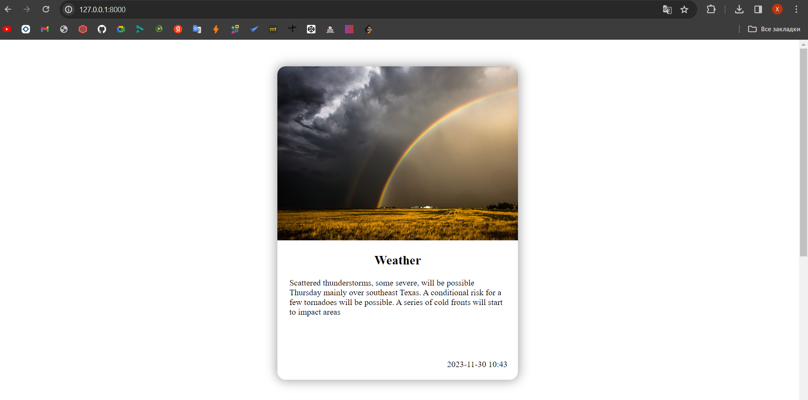
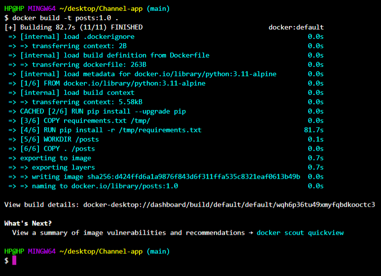
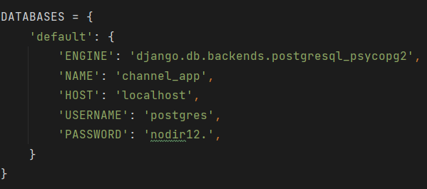

# Channel App
   


Channel App deb nomlangan ushbu Django loyihasi postlar yozishga mo'ljallangan
- [Docker o'rnatish](#docker)
- [O'rnatish](#o'rnatish)
- [Malumotlar bazasi](#psql)
- [Run](#run)

## Docker o'rnatish

1. **Dockerni yuklash**
   Sizda qanday OS bo'lsa https://www.docker.com/products/docker-desktop/ bu linkga kirib OS in tanlab yuklab oling

2. **Terminal code orqali yuklash**
   
   Macos uchun
   ```bash
   sudo hdiutil attach Docker.dmg
   sudo /Volumes/Docker/Docker.app/Contents/MacOS/install
   sudo hdiutil detach /Volumes/Docker
   ```
   Windows uchun
   ```bash
   choco install docker-desktop
   ```
   Linux uchun
   ```bash
   sudo apt-get update
   sudo apt-get install ./docker-desktop-<version>-<arch>.deb   
   ```
   Endi esa https://hub.docker.com/_/python shu linkdan python image ni yuklab oling
## O'rnatish

1. **Clone qilish**
   ```bash
   git clone https://github.com/abubakirovxolmirza/Channel_app


2. **Docker orqali packetlar o'rnatish**
   ```bash
   docker build -t posts:1.0 .
   ```
   


## Malumotlar bazasi

   1. O'zingizga kerakli SQL so'rov tilini tanlab unga ma'lumotlaringizni kirgazing
   

   Malumotlarni kirgazganingizdan keyin esa virtualenvga o'ting va malumotlaringizni saqlang.
   ```bash
   pipenv shell
   python manage.py makemigrations
   python manage.py migrate
   ```

## Run qilish
   1. Super User yaratib oling avvalo
   ```bash
   python manage.py createsuperuser
   ```
   2. Run qilish
   ```bash
   python manage.py runserver
   ```
   Admin pagega o'tib post qo'shing va postlaringizni ko'rib zavqlaning
   
   
